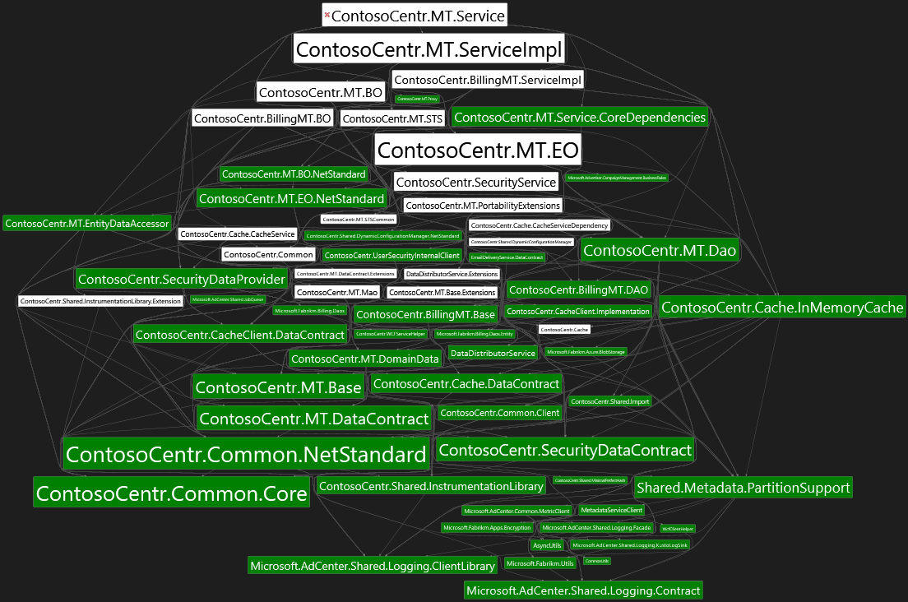

Contains set of analysis tools, used during .net core/ .net standard migration project from legacy .net framework.

List of commands:
* [graph](#graph)
* [stats](#stats)
* [ver](#ver)
* [conflicts](#conflicts)
* [refs](#refs)
* [listdep](#listdep)


graph
====
```
graph       {sourceAssembliesFolder} [{ignoreList}] [{outputFile}:output.dgml] [{rootAssembliesCsv}]
            about: creates a dependency graph which highlights .net standard compatible binaries shown with weighted dependencies. 
            param: sourceAssembliesFolder: used to extract assembly information. 
            param: ignoreList: items to ignore in rendering. Can be filepath that contains newline-separated assemblies, 
                   or comma-separated assemblies.
            param: outputFile: output filepath of dgml file.
            param: rootAssembliesCsv: specify root assemblies while creating graph. This is optional.
```
Example:
```
cmd: migrationutils graph . ignoreExternalAssembliesFile.txt result1.dgml

output written to 'result1.dgml'
```

Download DGML file [here](wiki/demo/result1.dgml). 
Refer ignoreExternalAssembliesFile.txt file [here](wiki/demo/ignoreExternalAssembliesFile.txt).

stats
====
```
stats       {sourceAssembliesFolder} [{ignoreList}] [{outputFile}:output.stats.txt] [{rootAssembliesCsv}]
            about: analyzes complexity of .net standard migration effort. 
                   - cluster assemblies based on framework 
                   - exclusive reference complexity (provides estimate of immediate migration effort)
                   - inclusive reference complexity (provides estimate of which assembly to pick-up next for migration)
                   PS, good to have, feature not supported now: highlight assemblies whose .net standard alternative is present in nuget. 
            param: sourceAssembliesFolder: used to extract assembly information. 
            param: ignoreList: items to ignore in rendering. Can be filepath that contains newline-separated assemblies, 
                   or comma-separated assemblies.
            param: outputFile: output filepath of analysis stats file.
            param: rootAssembliesCsv: specify root assemblies while creating graph. This is optional.
```
Example:
```
cmd: migrationutils stats . Advertising.Test,Castle.Core,ContosoCentr.MT.Mock.Dao result1.stats.txt

output written to 'result1.stats.txt'
```
Refer result1.stats.txt file [here](wiki/demo/result1.stats.txt).

ver
===
```
ver         {assemblyPath}
            about: gets assembly name, version, framework of a dll and its immediate dependencies.
            param: assemblyPath: path to assembly. 
```
Example:
```
cmd: migrationutils ver ContosoCentr.MT.EO.dll

ContosoCentr.MT.EO, Version=7.7.0.0, Framework=.NETFramework,Version=v4.7.2
-> ContosoCentr.BillingMT.Base, Version=7.7.0.0, Framework=.NETStandard,Version=v2.0
-> ContosoCentr.BillingMT.DAO, Version=7.7.0.0, Framework=.NETStandard,Version=v2.0
-> ContosoCentr.Cache.DataContract, Version=7.7.0.0, Framework=.NETStandard,Version=v2.0
-> ContosoCentr.Cache.InMemoryCache, Version=7.7.0.0, Framework=.NETStandard,Version=v2.0
-> ContosoCentr.CacheClient.DataContract, Version=7.7.0.0, Framework=.NETStandard,Version=v2.0
-> ContosoCentr.Common, Version=7.7.0.0, Framework=.NETFramework,Version=v4.7.2
-> ContosoCentr.Common.Client, Version=7.7.0.0, Framework=.NETStandard,Version=v2.0
-> ContosoCentr.Common.Core, Version=7.7.0.0, Framework=.NETStandard,Version=v2.0
-> ContosoCentr.Common.NetStandard, Version=7.7.0.0, Framework=.NETStandard,Version=v2.0
-> ContosoCentr.MT.Base, Version=7.7.0.0, Framework=.NETStandard,Version=v2.0
-> ContosoCentr.MT.Dao, Version=7.7.0.0, Framework=.NETStandard,Version=v2.0
-> ContosoCentr.MT.DataContract, Version=7.7.0.0, Framework=.NETStandard,Version=v2.0
-> ContosoCentr.MT.DomainData, Version=7.7.0.0, Framework=.NETStandard,Version=v2.0
-> ContosoCentr.MT.EntityDataAccessor, Version=7.7.0.0, Framework=.NETStandard,Version=v2.0
-> ContosoCentr.MT.EO.NetStandard, Version=7.7.0.0, Framework=.NETStandard,Version=v2.0
-> ContosoCentr.MT.Mao, Version=7.7.0.0, Framework=.NETFramework,Version=v4.7.2
-> ContosoCentr.SecurityDataContract, Version=7.7.0.0, Framework=.NETStandard,Version=v2.0
-> ContosoCentr.SecurityDataProvider, Version=7.7.0.0, Framework=.NETStandard,Version=v2.0
-> ContosoCentr.Shared.Import, Version=7.7.0.0, Framework=.NETStandard,Version=v2.0
-> ContosoCentr.Shared.InstrumentationLibrary, Version=7.7.0.0, Framework=.NETStandard,Version=v2.0
-> ContosoCentr.UserSecurityInternalClient, Version=7.7.0.0, Framework=.NETStandard,Version=v2.0
-> DataDistributorService, Version=7.7.0.0, Framework=.NETStandard,Version=v2.0
-> DataDistributorService.Extensions, Version=7.7.0.0, Framework=.NETFramework,Version=v4.7.2
-> EmailDeliveryService.DataContract, Version=7.7.0.0, Framework=.NETStandard,Version=v2.0
-> Kusto.Cloud.Platform, Version=6.2.1.0, Framework=.NETStandard,Version=v2.0
-> LINQtoCSV, Version=1.5.0.0, Framework=
-> Microsoft.AdCenter.Shared.CryptographyServices.Libs.Algorithms, Version=0.0.0.0, Framework=
-> Microsoft.AdCenter.Shared.JobQueue, Version=7.7.0.0, Framework=.NETStandard,Version=v2.0
-> Microsoft.AdCenter.Shared.Logging.ClientLibrary, Version=1.6.0.0, Framework=.NETStandard,Version=v2.0
-> Microsoft.AdCenter.Shared.Logging.Contract, Version=1.6.0.0, Framework=.NETStandard,Version=v2.0
-> Microsoft.Advertiser.CampaignManagement.BusinessRules, Version=0.0.0.0, Framework=.NETStandard,Version=v2.0
-> Microsoft.Advertising.ServiceLocation, Version=3.0.2021.1, Framework=
-> Microsoft.Azure.Cosmos.Table, Version=1.0.1.0, Framework=.NETStandard,Version=v2.0
-> Microsoft.Azure.Search, Version=3.0.0.0, Framework=.NETFramework,Version=v4.5
-> Microsoft.Azure.ServiceBus, Version=4.0.0.0, Framework=.NETStandard,Version=v2.0
-> Microsoft.Azure.Storage.Blob, Version=11.1.1.0, Framework=.NETFramework,Version=v4.5
-> Microsoft.Azure.Storage.Common, Version=11.1.1.0, Framework=.NETFramework,Version=v4.5
-> Microsoft.Fabrikm.Azure.BlobStorage, Version=1.6.0.0, Framework=.NETStandard,Version=v2.0
-> Microsoft.Fabrikm.Billing.Daos, Version=7.7.0.0, Framework=.NETStandard,Version=v2.0
-> Microsoft.Fabrikm.Billing.Daos.Entity, Version=7.7.0.0, Framework=.NETStandard,Version=v2.0
-> Microsoft.Fabrikm.Utils, Version=1.6.0.0, Framework=.NETStandard,Version=v2.0
-> Microsoft.CSharp, Version=4.0.0.0, Framework=
-> Microsoft.Practices.Unity, Version=2.1.505.0, Framework=
-> mscorlib, Version=4.0.0.0, Framework=
-> Newtonsoft.Json, Version=12.0.0.0, Framework=.NETFramework,Version=v4.5
-> NPOI, Version=1.2.1.0, Framework=.NETFramework,Version=v4.6.1
-> NPOI.OOXML, Version=1.2.1.0, Framework=.NETFramework,Version=v4.6.1
-> ServiceLocation, Version=1.6.0.0, Framework=
-> Shared.Metadata.PartitionSupport, Version=1.6.0.0, Framework=.NETStandard,Version=v2.0
-> System, Version=4.0.0.0, Framework=
-> System.ComponentModel.DataAnnotations, Version=4.0.0.0, Framework=
-> System.Configuration, Version=4.0.0.0, Framework=
-> System.Core, Version=4.0.0.0, Framework=
-> System.Data, Version=4.0.0.0, Framework=
-> System.Drawing, Version=4.0.0.0, Framework=
-> System.IdentityModel, Version=4.0.0.0, Framework=
-> System.Net.Http, Version=4.2.0.0, Framework=
-> System.Net.Http.Formatting, Version=5.2.7.0, Framework=.NETFramework,Version=v4.5
-> System.Runtime.Serialization, Version=4.0.0.0, Framework=
-> System.ServiceModel, Version=4.0.0.0, Framework=
-> System.ServiceModel.Web, Version=4.0.0.0, Framework=
-> System.Threading.Tasks.Dataflow, Version=4.6.5.0, Framework=
-> System.Transactions, Version=4.0.0.0, Framework=
-> System.Web, Version=4.0.0.0, Framework=
-> System.Web.Services, Version=4.0.0.0, Framework=
-> System.Xml, Version=4.0.0.0, Framework=
-> System.Xml.Linq, Version=4.0.0.0, Framework=
-> zxing, Version=0.16.5.0, Framework=.NETFramework,Version=v4.7
```

conflicts
=========
```
conflicts   {sourceAssembliesFolder} [{ignoreSystemLibraries}:true]
            about: lists all assembly reference conflicts within a build drop. 
            param: sourceAssembliesFolder: folder that contains assemblies. 
            param: ignoreSystemLibraries: ignores conflicts for system assemblies. default is true. 
```
Example:
```
cmd: migrationutils conflicts . true

=========> Possible conflicts for Microsoft.Azure.KeyVault:
ContosoCentr.Common.NetStandard                                        references Microsoft.Azure.KeyVault, Version=3.0.5.0, Culture=neutral, PublicKeyToken=31bf3856ad364e35
Kusto.Cloud.Platform.Azure                                             references Microsoft.Azure.KeyVault, Version=3.0.0.0, Culture=neutral, PublicKeyToken=31bf3856ad364e35
Microsoft.Fabrikm.Utils                                                references Microsoft.Azure.KeyVault, Version=3.0.0.0, Culture=neutral, PublicKeyToken=31bf3856ad364e35

=========> Possible conflicts for Microsoft.IdentityModel.Clients.ActiveDirectory:
ContosoCentr.Common.NetStandard                                        references Microsoft.IdentityModel.Clients.ActiveDirectory, Version=4.5.1.0, Culture=neutral, PublicKeyToken=31bf3856ad364e35
ContosoCentr.MT.Mao                                                    references Microsoft.IdentityModel.Clients.ActiveDirectory, Version=4.5.1.0, Culture=neutral, PublicKeyToken=31bf3856ad364e35
Kusto.Cloud.Platform.Azure                                             references Microsoft.IdentityModel.Clients.ActiveDirectory, Version=4.5.1.0, Culture=neutral, PublicKeyToken=31bf3856ad364e35
Kusto.Data                                                             references Microsoft.IdentityModel.Clients.ActiveDirectory, Version=4.5.1.0, Culture=neutral, PublicKeyToken=31bf3856ad364e35
Microsoft.Azure.EventHubs                                              references Microsoft.IdentityModel.Clients.ActiveDirectory, Version=4.5.0.0, Culture=neutral, PublicKeyToken=31bf3856ad364e35
Microsoft.Azure.Services.AppAuthentication                             references Microsoft.IdentityModel.Clients.ActiveDirectory, Version=3.14.2.11, Culture=neutral, PublicKeyToken=31bf3856ad364e35
Microsoft.Fabrikm.Utils                                                references Microsoft.IdentityModel.Clients.ActiveDirectory, Version=4.5.1.0, Culture=neutral, PublicKeyToken=31bf3856ad364e35
```

refs
====
```
refs        {sourceAssembliesFolder} {referencedAssemblyName}
            about: find all assemblies in the source folder, that references the specified assembly. 
            param: sourceAssembliesFolder: folder that contains referencing assemblies. 
            param: referencedAssemblyName: assembly that is being referenced.
```
Example:
```
cmd: migrationutils refs . ContosoCentr.Common

=========> Assemblies referencing for ContosoCentr.Common.Client
ContosoCentr.BillingMT.Base                                            references ContosoCentr.Common.Client
ContosoCentr.BillingMT.ServiceImpl                                     references ContosoCentr.Common.Client
ContosoCentr.MT.Base                                                   references ContosoCentr.Common.Client
ContosoCentr.MT.Dao                                                    references ContosoCentr.Common.Client
ContosoCentr.MT.EO                                                     references ContosoCentr.Common.Client
ContosoCentr.MT.Mao                                                    references ContosoCentr.Common.Client
ContosoCentr.MT.Mock.Dao                                               references ContosoCentr.Common.Client
ContosoCentr.MT.Mock.Mao                                               references ContosoCentr.Common.Client
ContosoCentr.MT.MockClients                                            references ContosoCentr.Common.Client
ContosoCentr.MT.PortabilityExtensions                                  references ContosoCentr.Common.Client
ContosoCentr.MT.Service.CoreDependencies                               references ContosoCentr.Common.Client
ContosoCentr.MT.Service.Diagnostics                                    references ContosoCentr.Common.Client
ContosoCentr.MT.Service                                                references ContosoCentr.Common.Client

=========> Assemblies referencing for ContosoCentr.Common
ContosoCentr.BillingMT.ServiceImpl                                     references ContosoCentr.Common
ContosoCentr.Cache.CacheService                                        references ContosoCentr.Common
ContosoCentr.Cache.CacheServiceDependency                              references ContosoCentr.Common
ContosoCentr.MT.EO                                                     references ContosoCentr.Common
ContosoCentr.MT.PortabilityExtensions                                  references ContosoCentr.Common
ContosoCentr.MT.ServiceImpl                                            references ContosoCentr.Common
ContosoCentr.MT.STS                                                    references ContosoCentr.Common
ContosoCentr.SecurityService                                           references ContosoCentr.Common
ContosoCentr.Shared.Diagnostics                                        references ContosoCentr.Common
ContosoCentr.MT.Service                                                references ContosoCentr.Common
```


listdep
====
```
listdep     {sourceAssembliesFolder} {assemblyName} [{ignoreSystemLibraries}:true]
            about: list all nested dependencies for a given assembly. 
            param: sourceAssembliesFolder: used to extract assembly information of dependencies. 
            param: assemblyName: assembly whose dependencies need to be listed.
            param: ignoreSystemLibraries: ignores conflicts for system assemblies. default is true. 
```
Example:
```
cmd: migrationutils listdep . Microsoft.Fabrikm.Apps.Encryption

===================> Assemblies referenced by Microsoft.Fabrikm.Apps.Encryption
Microsoft.Fabrikm.Apps.Encryption, Version=1.6.0.0, Framework=.NETStandard,Version=v2.0
  System.Configuration.ConfigurationManager, Version=4.0.1.0, Framework=
  AsyncUtils, Version=1.6.0.0, Framework=.NETStandard,Version=v2.0
    System.Memory, Version=4.0.1.1, Framework=
      System.Numerics.Vectors, Version=4.1.4.0, Framework=
      System.Runtime.CompilerServices.Unsafe, Version=4.0.6.0, Framework=
      System.Buffers, Version=4.0.3.0, Framework=
    Microsoft.AdCenter.Shared.Logging.Contract, Version=1.6.0.0, Framework=.NETStandard,Version=v2.0
    protobuf-net, Version=2.4.0.0, Framework=.NETFramework,Version=v4.0
    CommonUtils, Version=1.6.0.0, Framework=.NETStandard,Version=v2.0
      System.Configuration.ConfigurationManager, Version=4.0.1.0, Framework= ^
    System.Configuration.ConfigurationManager, Version=4.0.1.0, Framework= ^
```
